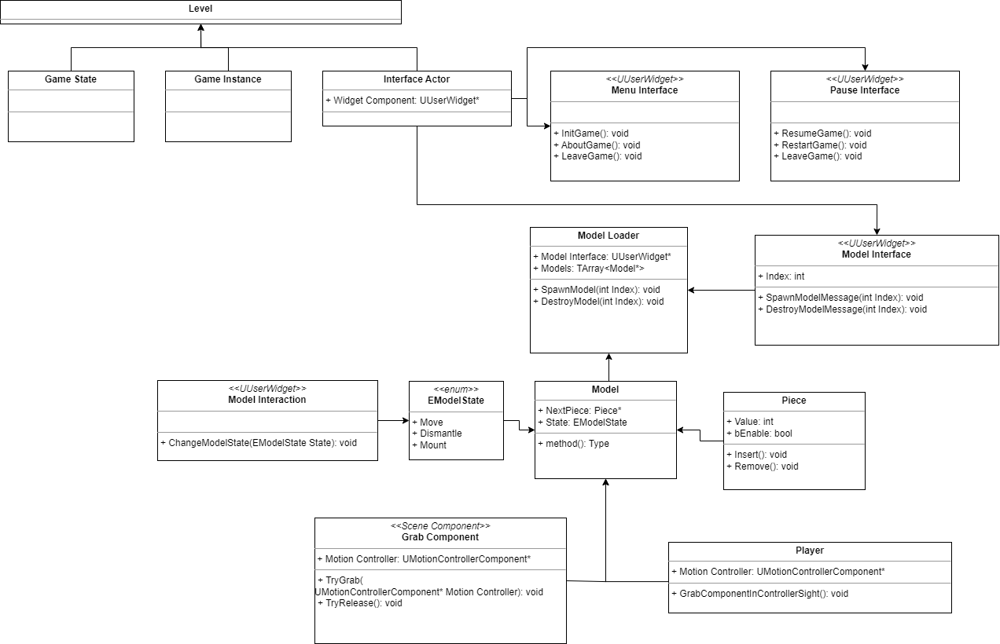

# Estrutura de produto

## Introdução
Este documento tem como objetivo documentar os detalhes técnicos utilizados na produção do software da experiência de estrutura de produto.

A experiência tem o intuito de desconstruir e reconstruir um produto através da manipulação.

## Descrição técnica
As tecnologias que podem ser utilizadas no desenvolvimento do software da experiência são:
- Unreal Engine 4.27.2 sendo a programação feita em C++ ou blueprints
- Git para controle de versão

A plataforma alvo da build do software são os óculos de RV. Para a compilação e build são utilizados as ferramentas Unreal e o Android SDK Platform Tools que realiza o link do apk para o óculos. Ainda para testes, pode-se utilizar a ferramenta do óculos utilizado no desenvolvimento o Pico Preview Tool.

Instruções e configurações para desenvolvimento estão disponíveis em:
https://github.com/pucpr-aia/vrconfigs/blob/main/picoconfig.md

## Escopo e funcionalidades
A seguir, estão listadas algumas funcionalidades a serem implementadas alinhadas com o documento de game design. Cada funcionalidade pode corresponder a um bloco de implementação. Não necessariamente deve ser realizado em sequência.

- Como sistema devo ser capaz de introduzir o usuário em como utilizar os controles
- Como sistema devo ser capaz de projetar modelos 3D de produtos 
- Como sistema devo ser capaz de apresentar interfaces de usuário que: descrevem um produto, descrevem um módulo, descrevem uma peça
- Como sistema devo ser capaz de habilitar a movimentação do modelo CAD inteiro ou apenas de peças
- Como jogador quero poder movimentar as peças do produto usando a movimentação do controle à distância
- Como jogador quero poder rotacionar as peças do produto usando a movimentação do controle à distância
- Como jogador quero poder redimensionar as peças do produto usando a movimentação do controle à distância
- Como jogador quero poder desmontar um produto utilizando os controles
- Como sistema devo ser capaz de desabilitar a colisão de uma peça quando for movimentada pelo usuário para não interfirir em outras peças
- Como sistema devo ser capaz de monitorar quantas peças foram retiradas
- Como sistema devo ser capaz de separar as peças removidas em módulos
- Como sistema devo ser capaz de disponibilizar as peças separadas em módulos para montagem

- Como jogador quero ser capaz que reconstruir o modelo 3D, inicialmente ligando peças dividas por módulos
- Como sistema devo ser capaz de monitorar qual a próxima peça a ser ligada (hierarquia)
- Como sistema devo ser capaz de monitorar quantas vezes uma peça incorreta foi introduzida
- Como sistema devo ser capaz de monitorar o tempo gasto em cada etapa do projeto

## Arquitetura
Dado o escopo e as funcionalidades, a seguinte arquitetura foi planejada.

**Interfaces de usuário:** Componentes responsáveis por fornecer a interface do usuário para a experiência. Eles precisarão disparar exibição dos modelos através do carregador de modelos, lidar com input do usuário e fornecer feedbacks.

**Componente carregador de modelos:** Este componente será responsável por carregar e descarregar os modelos 3D na experiência.

**Lógica para montagem e desmontagem de peças:**  Este componente será responsável por determinar o estado de um modelo. A princípio, um modelo possui 3 estados, sendo eles:
- Move: usuário pode movimentar a peça inteira mas não desmonta
- Dismantle: usuário pode remover a peça correta e movimentá-la
- Mount: usuário deve escolher peça correta e movimentá-la para posição de montagem

A lógica também determinará como o modelo pode ser desmontado em peças, monitorando a peça correta a ser removida, de acordo com a instrução física. Ele precisará definir os pontos de quebra e garantir que as peças possam ser destacadas sem causar colisões ou outros problemas.

**Player/Motion Controller:** Este componente será responsável por lidar com a entrada do usuário. Ele precisará detectar quando o usuário está tentando desmontar uma peça do modelo CAD e enviar os comandos apropriados para os outros componentes. A movimentação de outros componentes se dá pelo Grab Component. A ideia inicial é utilizar um feixe linear para detectar quando uma peça está no campo de visão e movimenta-la utlizando o conceito de spring arm.

## Testes de validação & Riscos
| Teste                                                                          | Justificativa                                                                                                     | Impacto |
|--------------------------------------------------------------------------------|-------------------------------------------------------------------------------------------------------------------|-------|
| Performance do óculos VR com os modelos CAD adaptados                          | Depende da abordagem para apresentar o modelo. Pela robustez da plataforma VR imagina-se que não será impactante. | Baixo |
| Movimentar cubos com o motion controle à distância                             | Necessário para movimentar os modelos 3D. Mecânica de spring arm a ser utilizada.                                 | Médio |
| Redimensionar e rotacionar objetos                                             | Necessário para evitar movimentação do player e sim das peças.                                                    | Médio |
| Lógica de encaixe/desmonte das peças                                           | Imprescindível para realizar a montagem e desmontagem.                                                            | Alto  |
| Distinguir entre peças e tipos de peças diferentes com uma hierarquia definida | Necessário para separação em módulos e auxiliar na montagem.                                                      | Alto  |