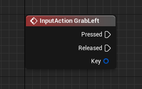
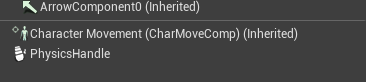
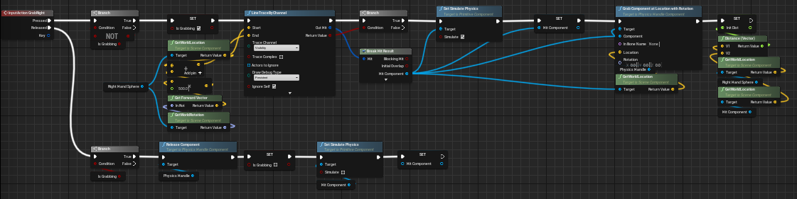
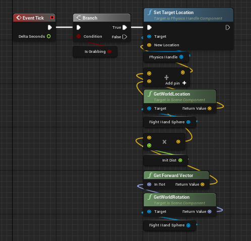

# Documentação dos testes

## Movimentar cubos com o motion controle à distância
Foi utilizado o template criado para projetos em VR encontrado na pasta
```
AIA-3060-2/Projetos/TemplateUEVR.zip
```

Através das input actions já definidas no projeto base, que podem ser encontrados em `Project Settings -> Input`. Utilizou-se os eventos disparados pelo BP_VRCharacter.

```
InputAction GrabRight
InputAction GrabLeft
```



As funções utilizam o componente `Physics Handle Component` para manejar objetos à distância, que foi adicionado ao `BP_VRCharacter`.



A interação inicia com uma linha gerada pela função `Line Trace By Channel` para verificar se na linha de visão do usuário existe um componente que pode ser movimentado. Posteriormente, caso encontrado, o componente é anexado ao componente Physics Handle com `Grab Component at Location with Rotation`.



O cálculo da movimentação do componente foi feito utilizando a localização do `Sphere Component` dos `Motion Controllers` e a localização do componente a ser movimentado. Durante a chamada da função `GrabRight` ou `GrabLeft`, a distância entre os dois atores é salva na variável float `InitDist` para manter o calculo atualizado usuário através da função `Tick` do `BP_VRCharacter` e `Set Target Location` do `Physics Handle Component`.



Com isso a funcionalidade foi implementada e validada.

## Redimensionar e rotacionar objetos 
...