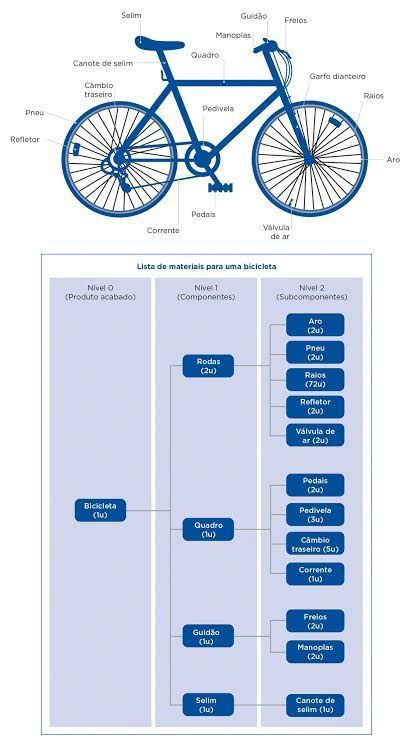

# Estrutura de Produto

## OBJETIVO

O projeto Estrutura de Produto tem como objetivo fornecer ao usuário uma experiência em realidade virtual para desconstruir e construir produtos utilizando modelos 3D.

## SOLUÇÃO

O roteiro da experiência é planejado de acordo com resultados esperados pelos professores solicitantes. Dessa forma, a pré produção da experiência definiu detalhamentos de game design, visual e programação para composição do roteiro, vindos de premissas necessárias na solução.

Algumas das funcionalidades essenciais:
- Manusear peças de um produto
- Observar descrições do produto
- Identificar diferentes peças e seus materiais
- Desmontar um produto
- Montar módulos do produto
- Montar o produto final

O estilo visual definido foi de uma abordagem mais simples dos produtos, também conhecida em termos de jogos como "low poly". A adoção de um estilo visual mais simples possibilita a produção autonoma dos produtos em 3D e mais facilidade na customização.

O ponto inicial da solução é utilizar um produto com complexidade simples para desenvolver uma versão funcional da experiência, a fim de testar e detectar possíveis melhorias. Com auxílio dos professores solicitantes, o produto escolhido foi uma bicicleta.

O diagrama demonstra detalhadamente os componentes da bicicleta, que serve como referência para o desenvolvimento da versão inicial da experiência. Como previsto, é possível realizar separação em módulos do produto inteiro e por fim separá-lo em peças elementares em que é possível definir o material e descrição da peça.

Protótipo de mecânicas: https://tinyurl.com/25jfrjyr

Senha: XRCENTER